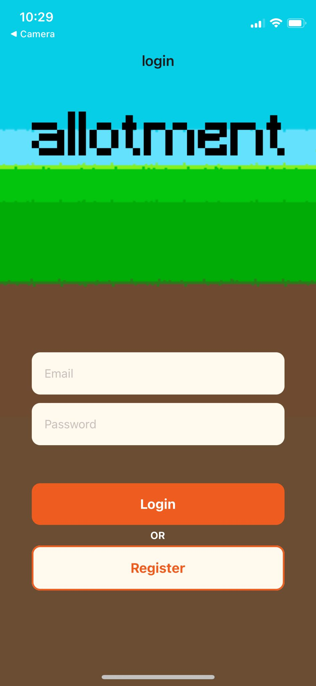
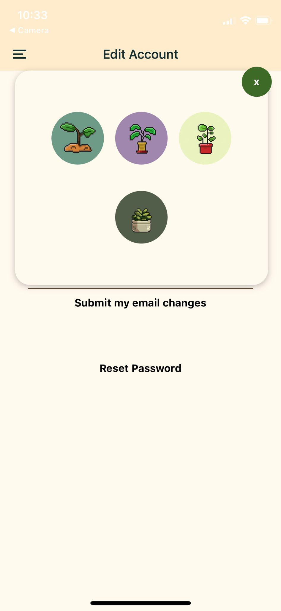
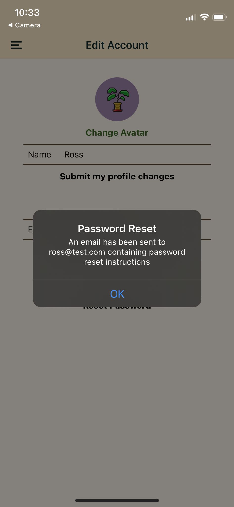
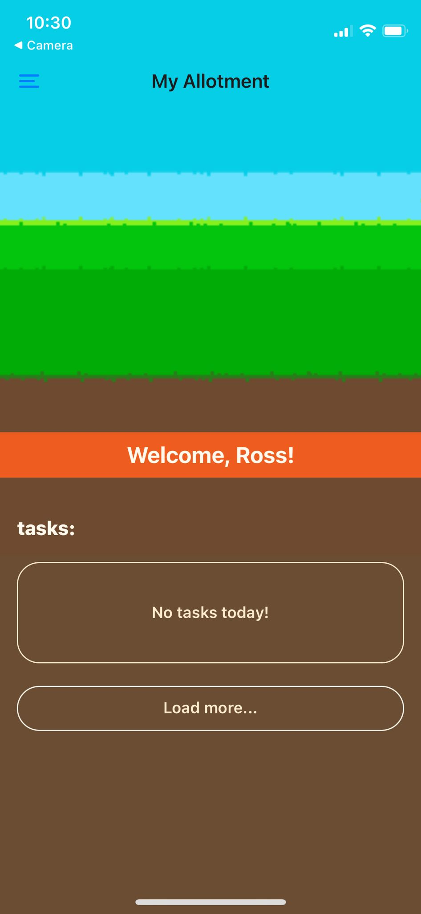
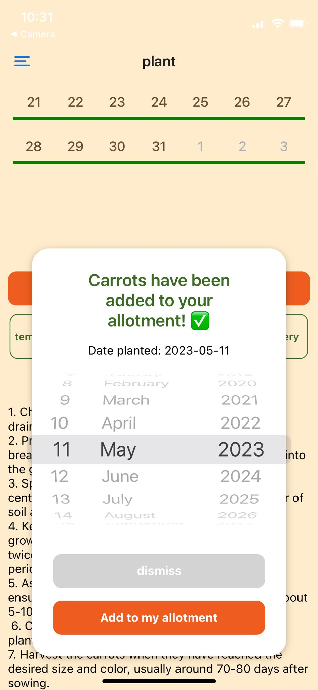
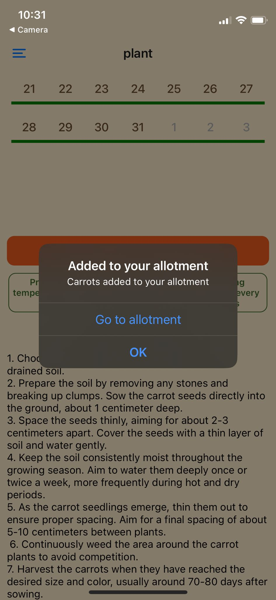
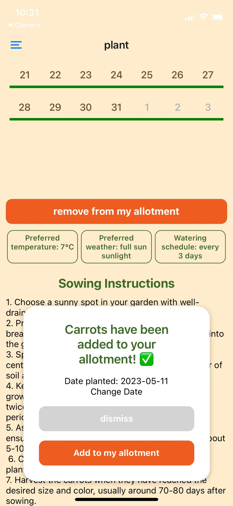
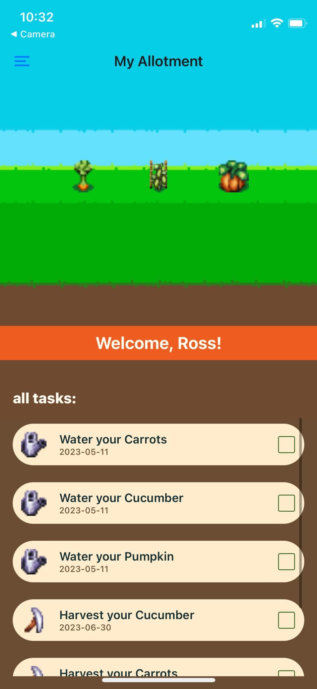

# Allotment

## About the this project:
This App was built in a team of 6 in the project phase of the software development bootcamp at Northcoders. It helps users organise and maintain a veg patch. 8-bit vegetables can be added to the user's in-app allotment, giving a harvesting window and task notifications.

This is the first page you will land on when you open the Allotment app. You can either log in or register.

When you click register your are given a choice of avatars to choose from and three feilds to fill out in order to create an account. You will enter your name, email and password.

Once you have logged in to the app, you also have the option to edit your account details

You can change your email, you can change your avatar, and your password.

When new users login into the app for the first time, the allotment will be completely emtpy!

The user can then use the Navbar on the left, click on 'plants' and got to the plants page:

The user can click on a single plant to go to the information page for that plant. For example, the carrots page shows a sowing and harvesting calendar for carrots and a button for the user to add it to their allotment...

...and sowing instructions for carrots...

When the user clicks on the add button they will be given a calendar to select a sowing date so that the harvesting window can be personalised for their allotment and put in their todo list.

Once the user has added a plant, they will be given the option to view their updated allotment#

Also the add button will become a remove button for the plant which has just been added.

Once the user has added their first plants, they will be able to view them in their allotment like so:

Tasks relating to plants in the user's allotment will be listed below the allotment display on their allotment page. They will also come through as notifications on a user's device, daily, and at a set time. Users can check off tasks they have completed.

The team wanted to use tamagotchi-style 8-bit vegetables to add a gamefied element to growing vegetables. Each plant has several images at different stages of growth to allow the user to see a visual progression in their allotment as time goes by, although this functionality has not been implemented yet. Here is an example of a full allotment.

The link below takes you to a video which demonstrates the app in action including navigation abd functionality.

    https://www.youtube.com/watch?v=GCAQsVTMuVE

    

## How to clone this project
First, fork this repo, then copy the URL, and in your terminal, use the command:

    git clone <forked-repo-URL>

## How to Install dependencies
Navigate to the root directory of the repository and run this command:

    npm install

## Firebase Explanation???

## Minimum version of Node.js needed:

    Node: v19.6.0
